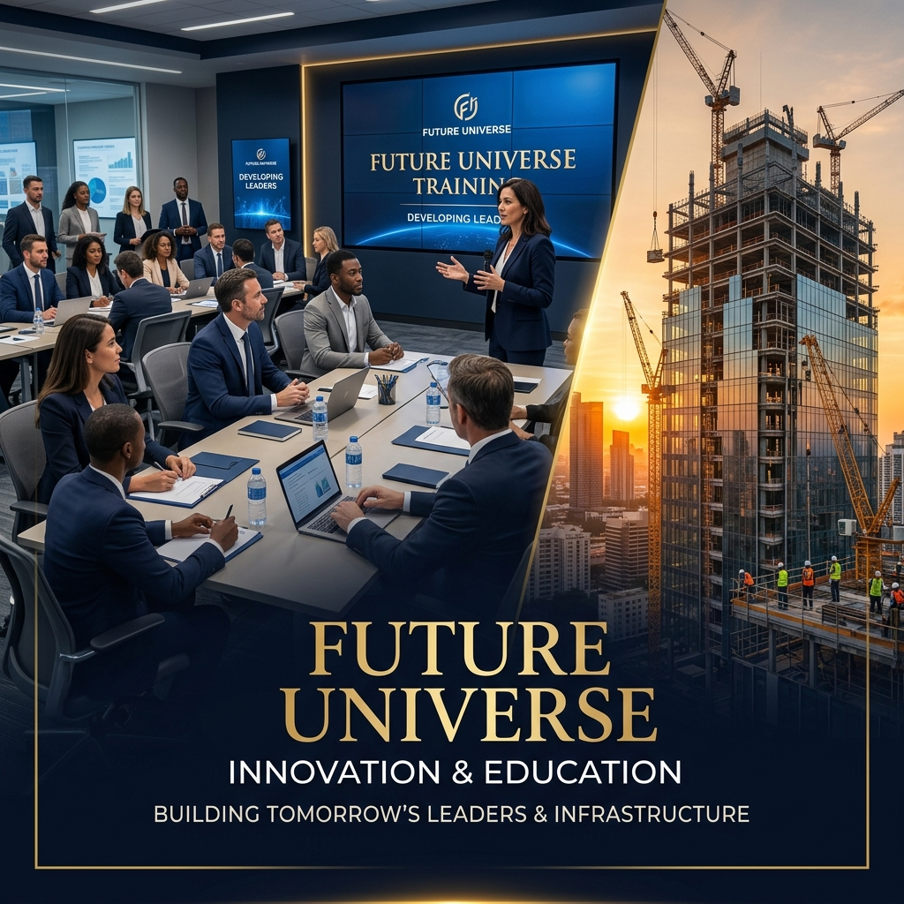

# 🌐 Future Universe — Official Corporate Website

<div align="center">
  

  <h3>Empowering People. Building Futures.</h3>
  
  [](https://futureuniverse.co)
  [](./LICENSE)
  [](https://developer.mozilla.org/en-US/docs/Web/HTML)
  [](https://developer.mozilla.org/en-US/docs/Web/CSS)
  [](https://developer.mozilla.org/en-US/docs/Web/JavaScript)
</div>

---

## 🏢 About Future Universe

**Future Universe** is a premier multi-disciplinary corporate group headquartered in **Muscat, Sultanate of Oman**, operating across four strategic business pillars:

| Division | Description |
|---|---|
| 🎓 **Education & Training** | Professional certifications, corporate training, leadership programs, IT & soft skills |
| 👥 **Human Resources** | Recruitment, talent acquisition, HR consulting, employee development |
| 🏗️ **Construction Solutions** | Commercial & residential construction, renovation, interior works, project management |
| 🧱 **Flooring Solutions** | Epoxy, vinyl, industrial, tile, and stone flooring installation & maintenance |

---

## 🌟 Website Features

- **Premium Corporate Design** — Navy Blue (`#0B1F3A`) & Gold (`#D4A017`) brand palette
- **Custom Cursor** — Gold dot with lagging ring effect
- **Scroll Progress Bar** — Gold gradient indicator
- **Hero Section** — Full-screen with Ken Burns zoom & particle field animation
- **Glassmorphic Cards** — Gold border-glow hover effects
- **Scroll Reveal Animations** — Staggered fade-up/left/right entrances
- **Animated Counters** — Triggered on scroll via Intersection Observer
- **Partners Ticker** — Infinite CSS scroll strip, pauses on hover
- **Testimonial Slider** — Auto-advancing with dot navigation
- **Projects Gallery** — Masonry layout with category filters & lightbox
- **Mobile Navigation** — Full-screen overlay with staggered animations
- **Fully Responsive** — Optimized for all screen sizes

---

## 📄 Pages

| Page | File | Description |
|---|---|---|
| Home | `index.html` | Full homepage with all sections |
| About Us | `about.html` | Company story, mission, vision, values |
| Education & Training | `education.html` | Training programs and courses |
| Human Resources | `hr.html` | HR solutions and recruitment services |
| Construction | `construction.html` | Construction services and portfolio |
| Flooring | `flooring.html` | Flooring types and installation services |
| Projects | `projects.html` | Masonry gallery with category filters |
| Blog | `blog.html` | Articles and insights |
| Contact Us | `contact.html` | Contact form and office information |

---

## 🗂️ Project Structure

```
FutureUniverse/
├── index.html              # Home page
├── about.html              # About Us
├── education.html          # Education & Training
├── hr.html                 # Human Resources
├── construction.html       # Construction Solutions
├── flooring.html           # Flooring Solutions
├── projects.html           # Projects & Gallery
├── blog.html               # Blog
├── contact.html            # Contact Us
├── css/
│   ├── main.css            # Design system, tokens, typography, grid
│   ├── components.css      # Navbar, hero, cards, footer, gallery
│   └── animations.css      # Scroll reveals, counters, transitions
├── js/
│   ├── main.js             # Navigation, cursor, slider, scroll effects
│   ├── counter.js          # Animated number counters
│   └── gallery.js          # Masonry filter and lightbox
├── images/
│   ├── hero_banner.png
│   ├── ceo_message.png
│   ├── education_banner.png
│   ├── hr_banner.png
│   ├── construction_banner.png
│   └── flooring_banner.png
├── README.md
└── LICENSE
```

---

## 🚀 Running Locally

No build tools required. Simply open `index.html` in any modern browser:

```bash
# Clone the repository
git clone https://github.com/yourusername/futureuniverse-website.git

# Navigate to the folder
cd futureuniverse-website

# Open in browser (Windows)
start index.html

# Open in browser (macOS)
open index.html
```

---

## 🛠️ Technology Stack

| Technology | Purpose |
|---|---|
| **HTML5** | Semantic markup and page structure |
| **Vanilla CSS3** | Design system, animations, responsive layout |
| **Vanilla JavaScript** | Interactions, animations, slider, gallery |
| **Font Awesome 6** | Icons (CDN) |
| **Google Fonts** | Playfair Display + Inter (CDN) |
| **Intersection Observer API** | Scroll-triggered animations and counters |

> No frameworks, no dependencies, no build step. Pure HTML/CSS/JS.

---

## 🌐 Deployment

Upload the entire project folder to any static web host:

- **cPanel / Hostinger / SiteGround** — Upload via File Manager or FTP
- **Netlify / Vercel** — Drag and drop the folder
- **GitHub Pages** — Enable Pages in repository settings

---

## 📞 Contact

**Future Universe**  
📍 Muscat, Sultanate of Oman  
📞 +968 94939932  
📧 info@futureuniverse.co  
🌐 [www.futureuniverse.co](https://futureuniverse.co)

---

## ⚖️ Copyright & License

© 2024 **Future Universe**. All Rights Reserved.

This website and all its contents — including but not limited to design, code, graphics, text, and images — are the **exclusive intellectual property of Future Universe**, Muscat, Sultanate of Oman.

See [LICENSE](./LICENSE) for full details.
